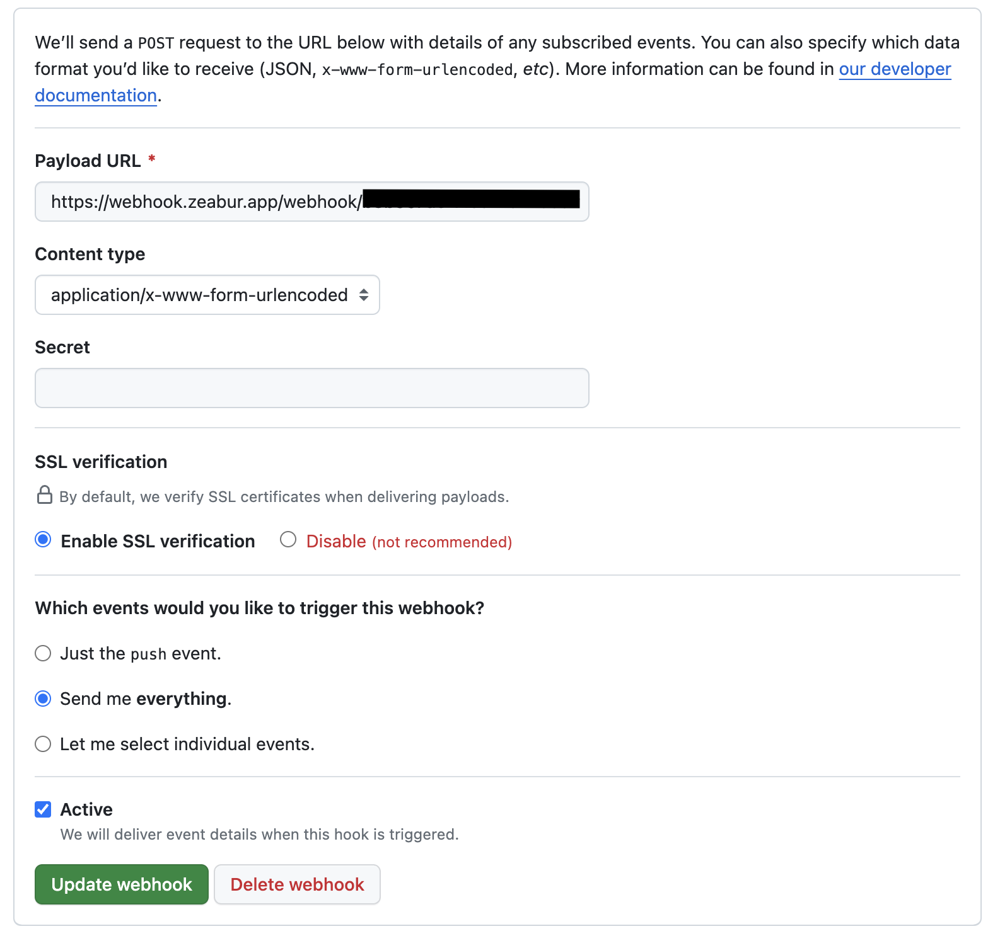
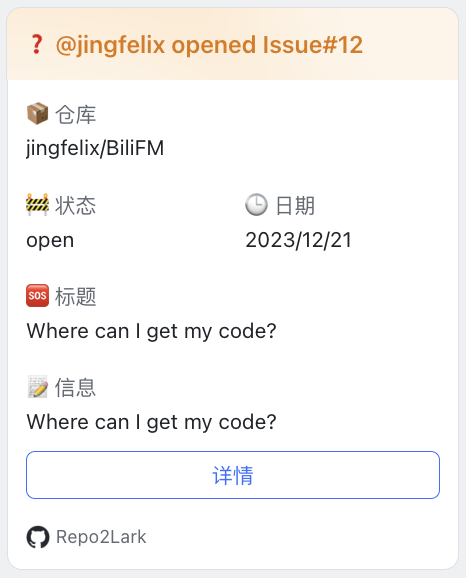

# Repo2Lark

优雅地转发 GitHub Webhook 事件到飞书。支持多种事件，支持自定义 Webhook Secret（仅独立部署）

## 使用

### 使用 Zeabur 上部署的公用服务

公用服务版不支持使用 GitHub Webhook Secret 和飞书 Webhook Secret。优点是使用方便，仅需替换 Webhook URL 即可。

具体步骤

1. 在飞书群组中添加一个 Webhook 机器人。

2. 获取飞书 Webhook URL（注：公用服务版不支持签名校验）

3. GitHub Repo Settings 中填写 Webhook URL，选择需要的事件。填写 `https://webhook.zeabur.app/webhook/{你的飞书 Webhook URL Token}` token 位于飞书 Webhook URL 结尾，形如b8b957dc-****...

4. 现在，当有指定事件发生时，飞书群组中就会收到消息了。

### 使用 Zeabur 一键部署公用版

### 使用 Zeabur 一键部署独立版

TODO

## 使用 Docker 部署

TODO

## 安全性

使用 GitHub/飞书 Webhook Secret 可以提高安全性，但需要独立部署。

## Supported Events

- [x] push

- [ ] pull_request

    - [ ] assigned

    - [ ] review_request

- [ ] pull_request_review

- [ ] pull_request_comment

- [x] issue

    - [ ] assigned

- [x] issue_comment

- [ ] workflow_run
